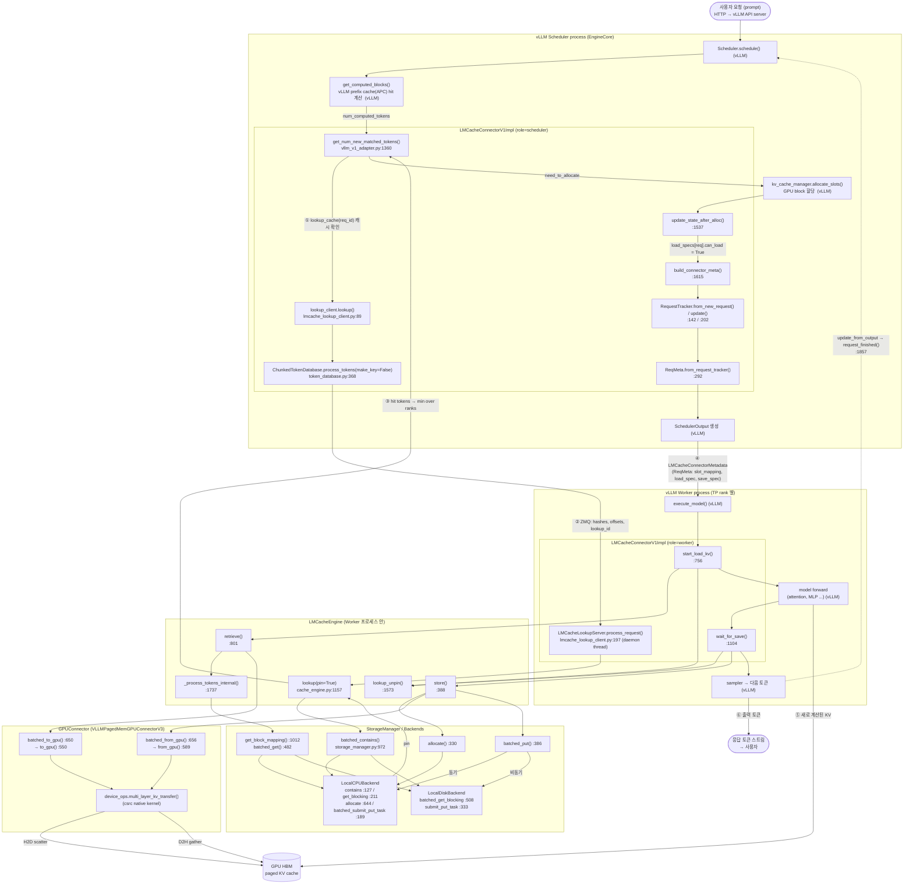

# LMCache Function View — 입력 요청부터 응답까지

하나의 추론 요청(prompt)이 vLLM 에 들어온 순간부터 토큰이 나가고 KV 가 저장되기까지, **어떤 함수가 어떤 순서로 호출되는지**를
함수 단위로 따라간다. 기준은 in-process 모드(`LMCacheConnectorV1`, non-layerwise, sync lookup, LocalCPU + LocalDisk)이며,
다른 모드와의 분기는 §4 에 따로 표시했다.

> **범위 주의**: `vLLM` 레인(`Scheduler.schedule`, `execute_model` 등)의 함수명은 vLLM 의 `KVConnectorBase_V1` 호출 규약에서
> 온 것으로, 이 repo 안에서 검증한 것이 아니다. LMCache 쪽 함수명과 `파일:라인` 은 이 repo 소스에서 직접 확인했다
> (라인은 이후 커밋으로 밀릴 수 있다).

---

## 1. Function View (전체 흐름, swimlane)

레인 = 프로세스/계층. 번호는 시간 순서이고, 굵은 구간(①~⑥)이 아래 §2 의 단계와 대응한다.



---

## 2. 단계별 함수 호출 트리

들여쓰기는 호출 깊이다. `[스레드]` 는 해당 함수가 도는 스레드/이벤트 루프, `(vLLM)` 은 repo 밖 함수다.

### ⓪ 요청 도착 (LMCache 는 아직 관여하지 않음)

```
HTTP /v1/completions  (vLLM API server)                                         (vLLM)
 └ tokenizer → EngineCore.add_request(request)                                  (vLLM)
     └ Scheduler.add_request()  → waiting queue                                 (vLLM)
```

### ① 스케줄링: "LMCache 에 얼마나 있나?" — Scheduler 프로세스

```
Scheduler.schedule()                                                            (vLLM)
 └ [waiting 의 request 마다]
    ├ kv_cache_manager.get_computed_blocks(request)  → num_computed_tokens       (vLLM, APC)
    └ connector.get_num_new_matched_tokens(request, num_computed_tokens)
       = LMCacheConnectorV1Dynamic.get_num_new_matched_tokens   lmcache_connector_v1.py:149
       └ LMCacheConnectorV1Impl.get_num_new_matched_tokens      vllm_v1_adapter.py:1360
          ├ (degraded / mock_req / producer) → return 0
          ├ lookup_client.lookup_cache(req_id)                  # 이미 결과 있으면 재사용
          ├ extract_mm_features / apply_mm_hashes_to_token_ids  # multimodal 이면 token 치환
          ├ extract_request_configs(sampling_params)
          ├ lookup_client.lookup(token_ids, lookup_id, request_configs)
          │   = LMCacheLookupClient.lookup                      lmcache_lookup_client.py:89
          │   ├ ChunkedTokenDatabase.process_tokens(make_key=False)   token_database.py:368
          │   │   ├ _chunk_tokens()  → chunk_size(256) 단위 분할
          │   │   └ _prefix_hash()   → _hash_tokens(chunk, prev_hash)  # prefix-chained hash
          │   ├ transport.send_and_recv_all([hashes, offsets, lookup_id, request_configs_json])
          │   │     └──────────── ZMQ ────────────►  (§ ② 로 이어짐)
          │   ├ num_hit = min(results over TP/PP ranks)
          │   └ reqs_status[lookup_id] = num_hit
          ├ need_to_allocate = hit - num_computed  (full hit 이면 -1)
          ├ min_retrieve_tokens / max_tokens_per_load 로 보정(chunk 정렬)
          ├ load_specs[req_id] = LoadSpec(vllm_cached, lmcache_cached, can_load=False)
          └ return need_to_allocate
```

### ② Lookup 서버 측 — Worker 프로세스의 daemon thread `[lookup-server-thread]`

```
LMCacheLookupServer.process_request  (while running)                lmcache_lookup_client.py:197
 ├ transport.recv_request()
 ├ lookup_id / request_configs 디코딩 (json.loads)
 ├ LMCacheEngine.lookup(hashes, offsets, lookup_id, pin=True, request_configs)   cache_engine.py:1157
 │   ├ is_healthy()  (불건강하면 0)
 │   ├ token_database.process_tokens(hashes=, offsets=)  → keys: list[CacheEngineKey]
 │   ├ StorageManager.batched_contains(keys, search_range, pin=True)        storage_manager.py:972
 │   │   └ [backend 를 계층 순으로] backend.batched_contains(keys, pin)
 │   │        ├ LocalCPUBackend: hot_cache 조회, hit 키 MemoryObj.pin()     local_cpu_backend.py:127
 │   │        └ LocalDiskBackend: self.dict 조회
 │   │      → (hit_chunks, block_mapping{backend: keys[:n]})   # 앞 backend 가 prefix 를 먼저 소비
 │   ├ lookup_pins[lookup_id] = block_mapping
 │   ├ (연속 prefix 끝 end 를 res 로)
 │   └ finally: stats_monitor.on_lookup_finished; storage_manager.touch_cache()
 └ transport.send_response(identity, hit.to_bytes(4, "big"))
```

### ③ 블록 할당 후 상태 확정 — Scheduler 프로세스

```
Scheduler.schedule() (이어서)                                                    (vLLM)
 ├ kv_cache_manager.allocate_slots(request, num_new_tokens, num_external_tokens)  (vLLM)
 └ connector.update_state_after_alloc(request, blocks, num_external_tokens)
    └ LMCacheConnectorV1Impl.update_state_after_alloc                            vllm_v1_adapter.py:1537
       ├ lookup_client.clear_lookup_status(req_id)
       ├ kv_transfer_params["disagg_spec"] → DisaggSpec → tmp_disagg_tracker     # P/D 일 때만
       ├ _unfinished_requests[req_id] = request
       ├ assert num_external == lmcache_cached - vllm_cached - recalc_last
       └ load_specs[req_id].can_load = True
```

### ④ 메타데이터 구성 — Scheduler 프로세스

```
Scheduler.schedule() 끝 → connector.build_connector_meta(scheduler_output)
└ LMCacheConnectorV1Impl.build_connector_meta                                    vllm_v1_adapter.py:1615
   ├ [finished_req_ids] _request_trackers / _unfinished_requests 정리
   ├ [scheduled_new_reqs]
   │   ├ load_specs.pop(req_id)
   │   ├ RequestTracker.from_new_request(config, request, num_tokens_to_compute, lmcache_cached, skip_save)   :142
   │   └ ReqMeta.from_request_tracker(tracker, block_size, chunk_size, load_spec, ...)                        :292
   │        ├ skip_save 판단 (disagg 아님 ∧ [이미 저장 ∨ chunk 경계 미달 ∨ decode ∧ !save_decode_cache ∨ skip_save 옵션])
   │        ├ num_tokens_to_save = chunk 정렬
   │        ├ SaveSpec(skip_leading_tokens, can_save)
   │        └ slot_mapping = block_ids * block_size + offsets  (flatten, 길이 = len(token_ids))
   └ [scheduled_cached_reqs: chunked prefill / decode / preempted 복귀]
       ├ RequestTracker.update(new_token_ids, new_block_ids, preempted, ...)                                  :202
       └ ReqMeta.from_request_tracker(...)
→ SchedulerOutput.kv_connector_metadata = LMCacheConnectorMetadata(requests=[ReqMeta ...])
   (vLLM 이 worker 프로세스로 전달)
```

### ⑤ 실행 — Worker 프로세스: Load → Forward → Save

```
Worker.execute_model(scheduler_output)                                           (vLLM)
 ├ connector.bind_connector_metadata(meta)                                       (vLLM)
 ├ connector.start_load_kv(forward_context)
 │  └ LMCacheConnectorV1Impl.start_load_kv                                       vllm_v1_adapter.py:756
 │     ├ attn_metadata is None / lmcache_engine is None → return  (recompute 로 fallback)
 │     └ [request.load_spec.can_load 인 request 마다]
 │        ├ slot_mapping.to(device)
 │        ├ token_mask[:vllm_cached // chunk * chunk] = False
 │        └ LMCacheEngine.retrieve(tokens[:lmcache_cached], mask, kvcaches, slot_mapping,
 │        │                        vllm_cached_tokens, request_configs, req_id)    cache_engine.py:801
 │        │  ├ _process_tokens_internal(tokens, mask, ret_mask, **kw)              :1737
 │        │  │   ├ token_database.process_tokens(tokens, mask)  → [(key,start,end)]
 │        │  │   ├ lookup_pins[req_id] 단일 location 이면 재사용
 │        │  │   │   아니면 StorageManager.get_block_mapping(chunk_infos)          storage_manager.py:1012
 │        │  │   └ [location 마다] StorageManager.batched_get(keys, location)      :482
 │        │  │        ├ backend.batched_get_blocking(keys)   # memory_obj.ref_count_up
 │        │  │        │    ├ LocalCPUBackend.get_blocking                           local_cpu_backend.py:211
 │        │  │        │    └ LocalDiskBackend.batched_get_blocking                  local_disk_backend.py:508
 │        │  │        └ LocalCPU 가 아닌 곳에서 성공 시 LocalCPUBackend.batched_submit_put_task (write-back)
 │        │  │      → reordered_chunks, ret_mask (첫 실패 chunk 이후 무효화)
 │        │  ├ (save_only_first_rank) _broadcast_or_receive_memory_objs
 │        │  ├ GPUConnector.batched_to_gpu(memory_objs, starts, ends, **kw)        gpu_connectors.py:650
 │        │  │   └ [load_stream] to_gpu(memory_obj, start, end)                    :550
 │        │  │        └ device_ops.multi_layer_kv_transfer(..., H2D, skip_prefix_n_tokens)  → GPU HBM
 │        │  │   └ load_stream.synchronize()
 │        │  └ [chunk 마다] memory_obj.ref_count_down()
 │        ├ lookup_unpin(req_id)  (async_loading 아닐 때)                           cache_engine.py:1573
 │        └ retrieved < expected → record_failed_blocks → _invalid_block_ids
 │
 ├ model.forward(...)   (vLLM)   # 필요한 만큼만 prefill; load 된 prefix 는 건너뜀
 │    └ (layerwise 일 때만) 각 attention layer 에서 wait_for_layer_load / save_kv_layer
 │
 └ connector.wait_for_save()
    └ LMCacheConnectorV1Impl.wait_for_save                                       vllm_v1_adapter.py:1104
       └ [request 마다]
          ├ lookup_unpin(req_id)                       # 로드에 안 쓰였어도 pin 해제
          ├ (can_save 아니거나 skip) → continue
          ├ skip_leading_tokens chunk 정렬 → store_mask
          └ LMCacheEngine.store(token_ids, mask, kvcaches, slot_mapping, offset,
          │                     transfer_spec, request_configs, req_id)             cache_engine.py:388
          │  ├ (unhealthy / passive rank / frozen) → return
          │  ├ [token_database.process_tokens(tokens, mask) 마다 chunk]
          │  │   └ StorageManager.allocate(shapes, dtypes, fmt)                    storage_manager.py:330
          │  │        └ LocalCPUBackend.allocate(eviction=True)                    local_cpu_backend.py:644
          │  │             (부족하면 cache_policy 로 evict, None 이면 거기까지만 저장)
          │  ├ GPUConnector.batched_from_gpu(memory_objs, starts, ends, **kw)      gpu_connectors.py:656
          │  │   └ from_gpu() :589 → multi_layer_kv_transfer(..., D2H) on store_stream
          │  └ StorageManager.batched_put(keys, memory_objs, transfer_spec, location)   storage_manager.py:386
          │      ├ [backend 마다] backend.batched_submit_put_task(keys, objs, transfer_spec)
          │      │    ├ LocalCPUBackend  : hot_cache 등록 (동기)                     local_cpu_backend.py:189
          │      │    ├ LocalDiskBackend : 용량 확인 → run_coroutine_threadsafe(async_save_bytes_to_disk)  local_disk_backend.py:333
          │      │    │                    [storage-manager-event-loop thread]
          │      │    └ Remote / P2P / PD: 각자의 async/transfer 경로
          │      └ 원본 memory_objs 전부 ref_count_down()
          └ save_spec.skip_leading_tokens = len(token_ids)   (last PP rank)
 └ connector.clear_connector_metadata()                                          (vLLM)
```

### ⑥ 출력 · 종료

```
Worker: sampler → 새 토큰                                                         (vLLM)
 └ connector.get_finished(finished_req_ids)  → (None, None)                       vllm_v1_adapter.py:1339
Scheduler: update_from_output() → 토큰 스트리밍 → 사용자                           (vLLM)
 └ [종료된 request] connector.request_finished(request, block_ids)                vllm_v1_adapter.py:1857
     ├ layerwise storer pop
     ├ ABORTED 면 storage_manager.cancel_request / (async 면) lookup_client.cancel_lookup
     ├ kv_transfer_params 구성 (first_tok, num_lmcache_cached_tokens)
     └ return (False, params)    # 블록 즉시 해제
다음 step: build_connector_meta → finished_req_ids 로 tracker 정리
```

---

## 3. 한 request 의 시간순 호출 요약 (함수 한 줄 흐름)

```
add_request
→ Scheduler.schedule
→ get_computed_blocks                         (APC)
→ connector.get_num_new_matched_tokens        ── lookup_client.lookup ──ZMQ──► LookupServer.process_request
                                                                             └ engine.lookup(pin=True)
                                                                               └ storage_manager.batched_contains
                                                                                 └ backend.batched_contains(pin)
                                              ◄── min(hit) ──
→ allocate_slots
→ connector.update_state_after_alloc          (can_load = True)
→ connector.build_connector_meta              (ReqMeta: slot_mapping / load_spec / save_spec)
→ [worker] start_load_kv
           └ engine.retrieve
             └ _process_tokens_internal → storage_manager.batched_get → backend.get_blocking
             └ gpu_connector.batched_to_gpu → multi_layer_kv_transfer(H2D)
           └ lookup_unpin
→ [worker] model.forward
→ [worker] wait_for_save
           └ lookup_unpin
           └ engine.store
             └ storage_manager.allocate → LocalCPUBackend.allocate
             └ gpu_connector.batched_from_gpu → multi_layer_kv_transfer(D2H)
             └ storage_manager.batched_put → CPU(sync) / Disk·Remote·PD(async)
→ sampler → 토큰 출력
→ request_finished
```

---

## 4. 모드별 분기 표 (같은 위치에서 어떤 함수로 갈라지나)

| 분기 지점 | 조건(config) | 실제 호출되는 함수 |
|---|---|---|
| lookup client 선택 | 기본 | `LMCacheLookupClient.lookup` (ZMQ sync) |
| | `enable_async_loading` | `LMCacheAsyncLookupClient.lookup` → server `engine.async_lookup_and_prefetch` → `StorageManager.async_lookup_and_prefetch` |
| | `enable_scheduler_bypass_lookup` | `LMCacheBypassLookupClient` (scheduler 가 engine 직접 호출) |
| load | 기본 | `engine.retrieve` → `_process_tokens_internal` |
| | `enable_async_loading` | `engine.retrieve` → `_async_process_tokens_internal` (`EventManager` future 사용) |
| | `use_layerwise` | `engine.retrieve_layer` generator (`start_load_kv` 에서 `next()` 2회, 이후 `wait_for_layer_load`) |
| | `enable_blending` | `self.blender.blend(...)` |
| save | 기본 | `wait_for_save` → `engine.store` |
| | `use_layerwise` | `save_kv_layer` 마다 `engine.store_layer` generator `next()`, `wait_for_save` 는 마무리·unpin |
| | `kv_consumer` | store 생략, `lookup_unpin` 만 |
| GPU connector | CUDA 기본 | `VLLMPagedMemGPUConnectorV3` (`use_gpu_connector_v3`), 아니면 `V2` |
| | layerwise | `VLLMPagedMemLayerwiseGPUConnector` / (blending) `VLLMBufferLayerwiseGPUConnector` |
| | MLA + `save_only_first_rank` | leader 만 store, `_broadcast_or_receive_memory_objs` 로 TP 에 전파 |
| 전체 | **MP 모드** | 위 LMCache 쪽 호출 전체가 `LMCacheMPConnector` → `MPSchedulerAdapter.maybe_submit_lookup_request / check_lookup_result`, `MPWorkerAdapter.submit_retrieve_request / submit_store_request` → 서버 `LookupModule.lookup`, `LMCacheDrivenTransferModule.store / retrieve` 로 대체 (`lmcache-call-path.md` §6, `lmcache-uml.md` §14 참고) |
| 초기화 실패 | `_init_failed` | 모든 hook 이 `lmcache_engine is None` / `lookup_client is None` 에서 즉시 return → vLLM recompute |

---

## 5. 호출 빈도 / 스레드 관점의 메모

| 함수 | 호출 주기 | 실행 스레드 | critical path 여부 |
|---|---|---|---|
| `get_num_new_matched_tokens` + `lookup` | request 당 1회(+preemption 재시도, 캐시로 idempotent) | Scheduler 메인 스레드 → ZMQ 동기 대기 | **O** (scheduling 지연에 직접 영향) |
| `LMCacheLookupServer.process_request` | request 당 1회 / rank | worker daemon thread | O (scheduler 가 응답을 기다림) |
| `build_connector_meta` | step 마다 | Scheduler 메인 | O |
| `start_load_kv` → `retrieve` | cache hit 있는 request 의 첫 prefill step | Worker 메인 | **O** (H2D 완료까지 동기, `load_stream.synchronize`) |
| `wait_for_save` → `store` | step 마다 (저장할 chunk 가 생길 때) | Worker 메인 | **O** (D2H 는 동기, CPU put 도 동기) |
| Disk/Remote `submit_put_task` 이후 쓰기 | `store` 직후 | `storage-manager-event-loop` thread | X (비동기) |
| `request_finished` | request 당 1회 | Scheduler 메인 | X |
