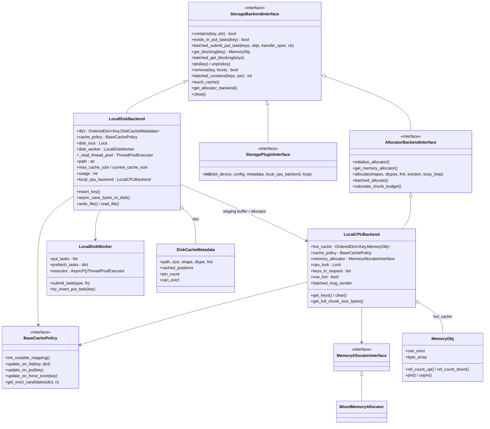
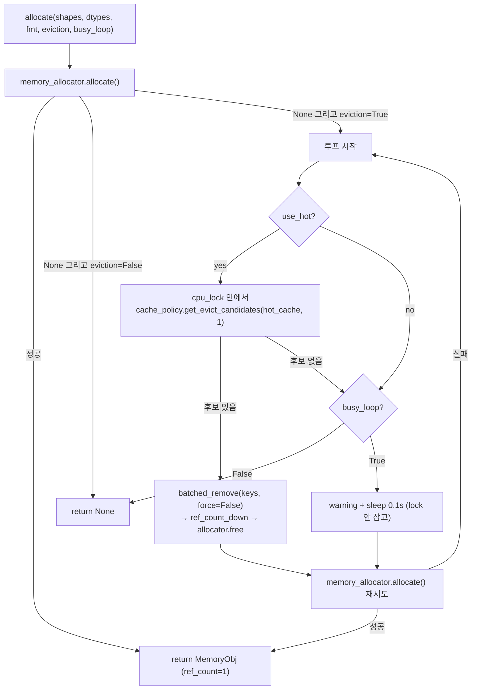
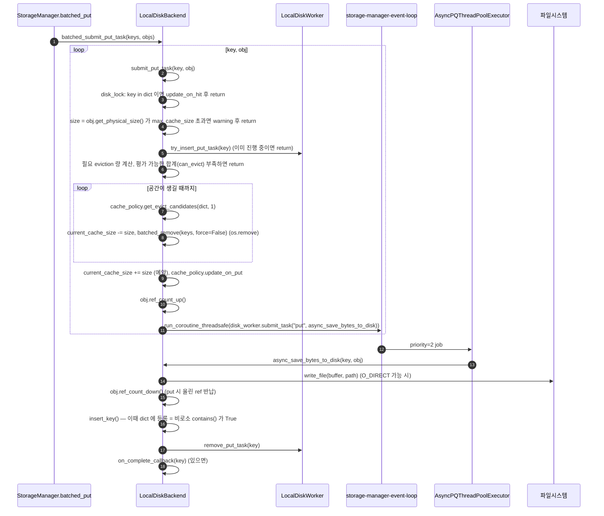

# LocalCPUBackend / LocalDiskBackend 내부 구조와 새 메모리 티어 추가 가이드

목적: 새 메모리 티어(예: CXL, 다른 종류의 메모리/스토리지)를 붙일 때 **어떤 backend 에 어떤 기능을 구현해야 하는지**를
기존 두 backend 의 동작을 기준으로 정리한다. 대상은 in-process 경로의 `lmcache/v1/storage_backend/` 이다.
(MP 모드의 `distributed/l2_adapters/` 는 인터페이스가 다르며 §8 에서 간단히만 언급한다.)

근거: 모두 소스에서 직접 읽은 것이다(`abstract_backend.py`, `local_cpu_backend.py`, `local_disk_backend.py`,
`storage_manager.py`, `cache_policy/`, `memory_management.py`, `plugins/dax_backend.py`). 라인 번호는 이후 커밋으로 밀릴 수 있고,
"확인 필요" 는 코드를 읽고도 단정하지 못한 부분이다. 실행/테스트로 검증한 것은 없다.

---

## 1. 큰 그림: backend 는 무엇을 책임지는가

`StorageManager` 는 backend 목록(`OrderedDict[str, StorageBackendInterface]`)을 **생성 순서대로** 순회한다.
backend 는 "key(`CacheEngineKey`) → KV chunk(`MemoryObj`)" 저장소 역할만 하고, 다음은 backend 가 **하지 않는다**.

| 책임 | 누가 |
|---|---|
| token → chunk hash → key 변환 | `TokenDatabase` |
| 여러 tier 에 걸친 prefix 연쇄 판정 | `StorageManager.batched_contains` / `get_block_mapping` |
| GPU ↔ CPU 복사 | `GPUConnector` |
| tier 간 write-back (Disk → CPU) | `StorageManager.batched_get` |
| 한 tier 안의 보관, eviction, pin, 용량, 비동기 I/O | **backend** |

```
LMCacheEngine ──► StorageManager ──► [backend 0] LocalCPUBackend   (allocator + hot cache + 다른 tier 의 staging buffer)
                                 ├─► [backend 1] P2PBackend / Nixl ...
                                 ├─► [backend 2] LocalDiskBackend  (staging 은 CPU 에 의존)
                                 └─► [backend N] RemoteBackend / plugin ...
```

---

## 2. 인터페이스 계약 (`abstract_backend.py`)

### 2.1 `StorageBackendInterface`

| 메서드 | 필수? | 계약 |
|---|---|---|
| `contains(key, pin=False) -> bool` | **abstract** | 키가 **완료된** 상태로 존재하면 True. `pin=True` 면 해당 항목을 pin(eviction 금지)해야 한다. lookup 이 `pin=True` 로 호출한다. |
| `exists_in_put_tasks(key) -> bool` | **abstract** | 쓰기가 진행 중인지. `contains()` 와 함께 확인해서 중복 put 을 피한다(CPU 는 항상 False). |
| `batched_submit_put_task(keys, objs, transfer_spec, on_complete_callback)` | **abstract** | 비동기 put. 동기 backend 면 `None`, 비동기면 `list[Future]` 또는 `None`. **store critical path 에서 호출되므로 오래 막으면 안 된다.** key 단위 완료 콜백 지원은 선택. |
| `get_blocking(key) -> Optional[MemoryObj]` | **abstract** | 동기 get. 없으면 `None`. |
| `pin(key)` / `unpin(key)` | **abstract** | pin 카운트 증감. 항목이 없으면 `False`. |
| `remove(key, force=True) -> bool` | **abstract** | `force=True`: 외부 요청(clear/remove), `False`: 내부 eviction. |
| `get_allocator_backend()` | **abstract** | get 결과 `MemoryObj` 를 할당하는 allocator backend 를 반환. 대부분 `LocalCPUBackend`. |
| `close()` | **abstract** | 스레드/파일/메모리 정리. |
| `batched_contains(keys, pin) -> int` | 기본 구현 있음 | 기본은 `contains` 를 순서대로 돌며 **첫 miss 에서 중단**하고 hit 수를 반환(= prefix 의미론). 일괄 최적화가 가능하면 override. |
| `batched_get_blocking(keys)` | 기본 구현 있음 | 기본은 `get_blocking` 반복. 일괄 이득이 있으면 override (Disk 가 병렬 read 로 override). |
| `batched_remove(keys, force)` | 기본 구현 있음 | `remove` 반복. |
| `touch_cache()` | 기본 **`raise NotImplementedError`** | docstring 은 "기본은 아무것도 안 함"이라고 적혀 있으나 실제 기본 구현은 예외를 던진다(`abstract_backend.py:295-308`). **아래 §7 의 StorageManager 하드코딩과 함께 주의.** |
| `cancel_request(req_id)` | 기본 no-op | request 별 상태를 가진 backend(PD async)만 override. |
| `get_non_blocking`, `batched_async_contains`, `batched_get_non_blocking`, `async_batched_submit_put_task` | 기본 `NotImplementedError` | **`enable_async_loading` 을 지원하려면 `batched_async_contains` + `batched_get_non_blocking` 이 필요**하다. |

### 2.2 `AllocatorBackendInterface` (추가 계약)

backend 가 **자기 메모리에서 `MemoryObj` 를 직접 내줄 수 있을 때**만 구현한다.
`initialize_allocator`, `get_memory_allocator`, `allocate(shapes, dtypes, fmt, eviction, busy_loop)`,
`batched_allocate`, `calculate_chunk_budget`. `store()` 는 GPU → CPU 복사 목적지를 항상
`StorageManager.allocate()` → **allocator backend** 에서 받는다.

### 2.3 `StoragePluginInterface`

`StorageBackendInterface` + 생성자 `(dst_device, config, metadata, local_cpu_backend, loop)` 규약.
설정으로 외부 클래스를 끼워 넣는 확장점이다(§6).

---

## 3. 클래스 구조



---

## 4. `LocalCPUBackend` 상세

### 4.1 세 가지 역할

1. **allocator**: store 시 GPU → CPU 복사 목적지(`MemoryObj`)를 내준다 (`allocate`).
2. **hot cache**: `hot_cache` 에 KV 를 보관하고 lookup/get 에 응답한다 (`config.local_cpu=True` 일 때, `use_hot`).
3. **다른 tier 의 staging buffer**: Disk/Remote/P2P 에서 읽은 데이터가 먼저 올라오는 CPU 버퍼. 그래서 backend 목록에서 **항상 먼저 생성**된다
   (`CreateStorageBackends` 의 "local_cpu backend is always created because other backends might need it as a buffer").

`local_cpu=False` 여도 (2)만 꺼질 뿐 (1)(3)은 계속 동작한다. 클래스 docstring 도 "hot_cache 를 쓰지 않아도 `contains/insert_key/remove/get_blocking/get_keys/clear` 는 호출될 수 있다"고 적는다.

### 4.2 내부 상태

| 필드 | 의미 |
|---|---|
| `hot_cache` | `cache_policy.init_mutable_mapping()` 결과(LRU 면 `OrderedDict`). key → `MemoryObj`. |
| `cache_policy` | `get_cache_policy(config.cache_policy)` — LRU / LFU / FIFO / MRU (`cache_policy/__init__.py`). |
| `memory_allocator` | `initialize_allocator()` 가 고르는 pinned host 메모리 풀(`MixedMemoryAllocator` 기본, P2P 면 `PagedCpuGpuMemoryAllocator`). |
| `cpu_lock` | `hot_cache` 보호용 `threading.Lock`. |
| `keys_in_request` | 한 lookup 에서 pin 한 key 목록. `touch_cache()` 가 LRU 순서 보정에 사용(역순으로 `update_on_hit`). |
| `batched_msg_sender` | controller 로 ADMIT / EVICT 메시지 batching 전송(`lmcache_worker` 있을 때). |
| `use_hot`, `layerwise`, `enable_blending` | 동작/포맷 분기. layerwise 면 `MemoryFormat.KV_T2D`, blending 이면 `KV_2TD`, 아니면 `KV_2LTD`. |

### 4.3 메서드별 동작

| 메서드 | 동작 (라인) |
|---|---|
| `contains(key, pin)` | `cpu_lock` 안에서 `key in hot_cache`; `pin` 이면 `hot_cache[key].pin()` + `keys_in_request.append(key)` (`:127`) |
| `touch_cache()` | `keys_in_request` 를 **역순**으로 `cache_policy.update_on_hit` 후 비움 — 한 request 의 chunk 가 prefix→suffix 순서로 LRU 에 쌓이도록 (`:137`) |
| `exists_in_put_tasks` | 항상 `False` (put 이 동기) (`:144`) |
| `submit_put_task(key, obj)` | 이미 있으면 skip; 아니면 `obj.ref_count_up()` → `hot_cache[key]=obj` → `cache_policy.update_on_put` → controller ADMIT 메시지. **동기.** (`:150`) |
| `batched_submit_put_task` | `use_hot` 가 아니면 즉시 return; 아니면 `submit_put_task` 반복 (`:189`) |
| `get_blocking(key)` | 있으면 `memory_obj.ref_count_up()` 후 반환(호출자가 `ref_count_down`). eviction 과의 race 방지를 위해 lock 안에서 ref 를 올린다 (`:211`) |
| `batched_get_non_blocking` / `batched_async_contains` | async loading 용. `hot_cache[key]` 직접 접근(없으면 KeyError — `contains` 로 사전 확인된 전제), prefix 만 센다 (`:225`, `:239`) |
| `pin` / `unpin` | `hot_cache[key].pin()/unpin()` (`:258`, `:266`) |
| `remove(key, force)` | `force=True` 면 `cpu_lock` 획득, 남은 pin 전부 해제 후 `ref_count_down` + `update_on_force_evict`. `force=False`(eviction)면 **lock 을 잡지 않는다(호출자가 이미 보유)**. controller EVICT 메시지 (`:274`) |
| `allocate(...)` | §4.4 |
| `batched_allocate(...)` | layerwise 용(`batch_size = num_layers`). 후보를 layer 전체 단위로 묶어 evict (`:749`) |
| `calculate_chunk_budget()` | `max_local_cpu_size / aligned_chunk_bytes` — async loading 에서 동시 할당 deadlock 방지용 budget (`:925`) |
| `get_keys()` / `clear()` | LRU→MRU 순 key 목록 / `can_evict` 인 것만 제거 (`:946`, `:953`) |
| `close()` | message sender 종료, allocator close, `clear()` (`:981`) |

### 4.4 `allocate()` 와 eviction 흐름



핵심:
- 후보 선정은 정책 객체가 하며 `cache.can_evict` 가 아닌 항목은 건너뛴다 (`lru.py` `get_evict_candidates`).
  `MemoryObj.can_evict = (not is_pinned) and (ref_count == 1)` (`memory_management.py:897`). 즉 **hot_cache 가 쥔 ref 1개만 남은 항목만** evict 된다.
- `busy_loop` 은 **retrieve 쪽에서만** 의미가 있다. docstring: store 는 동시에 여러 개가 돌아 busy loop 을 하면 deadlock 이 나므로 store 에서는 `busy_loop=False`(`force_store_wait` 옵션이 있으면 예외).
  메모리가 부족하면 `store()` 는 확보한 chunk 까지만 저장하고 중단한다(`cache_engine.py:518-525`).
- 후보를 1개씩만 뽑는다("TODO: `num_candidates` 추정 최적화" — 단편화 때문에 정확한 추정이 어렵다고 주석).

### 4.5 `MemoryObj` ref / pin 규칙 (CPU backend 의 핵심 불변식)

```
allocator.allocate        → ref=1           (store 가 소유)
submit_put_task           → ref+1 = 2       (hot_cache 소유)
StorageManager.batched_put 끝 → ref-1 = 1   (store 의 소유 반납) ← 이후 hot_cache 만 1 ref → evictable
lookup(pin=True)          → pin_count+1     (evict 불가, 해제 시 free 도 방지: ref==0 이어도 pin>0 이면 free 안 함)
get_blocking              → ref+1           (호출자가 retrieve 후 ref_count_down)
```

---

## 5. `LocalDiskBackend` 상세

### 5.1 역할과 의존

- **순수 저장 tier** (allocator 아님). 메모리는 직접 못 내주므로 `get_allocator_backend()` 는 `local_cpu_backend` 를 반환하고,
  읽은 파일 내용은 항상 **CPU staging `MemoryObj`**(`local_cpu_backend.allocate`)에 올려 호출자에게 준다.
- 즉 disk → GPU 직행은 없고 disk → CPU buffer → GPU 이다(코드 주석에는 "disk→gpu 가 더 빠를 수 있다"는 언급이 있으나 현재 구현은 CPU 경유).

### 5.2 내부 상태

| 필드 | 의미 |
|---|---|
| `dict` | `cache_policy.init_mutable_mapping()`; key → `DiskCacheMetadata(path, size, shape, dtype, cached_positions, fmt, pin_count)`. **데이터가 아니라 메타만** 메모리에 있다. `can_evict = not is_pinned`. |
| `disk_lock` | `dict` 보호. |
| `disk_worker` (`LocalDiskWorker`) | `put_tasks`(진행 중 쓰기 key 목록, 중복 방지), `prefetch_tasks`, `AsyncPQThreadPoolExecutor`(우선순위 큐 스레드풀; task 타입별 priority 0=prefetch, 1=delete, 2=put). |
| `_read_thread_pool` | blocking 병렬 read 용 일반 `ThreadPoolExecutor` (`disk_io_threads`, 기본 4). |
| `path` | `PathSharder` 가 `local_disk` 설정(콤마 목록)에서 선택한 디렉터리. 파일명은 `key.to_string()` 의 `/` 를 `-` 로 바꾸고 `.pt` (`_key_to_path`). |
| `max_cache_size`, `current_cache_size` | 용량 상한(`max_local_disk_size` GB)과 **예약 포함** 현재 사용량(admission 시 증가). |
| `usage` | 메트릭용 실사용 바이트(쓰기 시작 시 증가, `remove` 시 감소). |
| `use_odirect`, `os_disk_bs` | O_DIRECT 사용 여부, 파일시스템 block size(크기가 정렬되지 않으면 일반 IO 로 fallback). |
| `keys_in_request` | CPU backend 와 동일한 용도. |

### 5.3 Put 경로 (비동기)



설계 포인트:
- **쓰기 완료 후에야 `dict` 에 등록**된다. 그 전까지는 `contains()=False` 이고 `exists_in_put_tasks()=True` 이다. (`abstract_backend` 가 둘을 함께 보라고 적은 이유)
- 용량 예약(`current_cache_size += size`)은 쓰기 **시작 전**이라, 동시 put 이 용량을 초과하지 않게 한다.
- 용량이 모자라고 evict 가능한 항목(`can_evict`)도 부족하면 조용히 drop 한다(warning). store 는 실패하지 않고 그냥 이 tier 에만 안 쌓인다.
- 파일 삭제(`os.remove`)는 동기로 호출한다. 코드 주석: 이를 `disk_worker` 로 비동기 위임하면 deadlock 이 난다.

### 5.4 Get 경로

| 메서드 | 동작 |
|---|---|
| `get_blocking(key)` | lock 안에서 메타 복사 → **lock 밖에서** `local_cpu_backend.allocate()` + `read_file` → 성공 시에만 lock 재획득해 `update_on_hit`. (lock 을 잡고 I/O 하면 insert/evict 와 deadlock) |
| `batched_get_blocking(keys)` | 키 1개 이하면 단건. 아니면 ① 메타 일괄 조회 ② CPU staging 을 **순차** 할당 ③ `_read_thread_pool.map` 으로 **병렬 read**(`readinto` 가 GIL 해제) ④ 성공분만 `update_on_hit`. 할당 실패한 key 는 `None`. |
| `batched_async_contains` / `batched_get_non_blocking` | async loading 용. 읽기 전에 dict 항목과 staging `MemoryObj` 를 모두 pin 하고, `disk_worker.submit_task("prefetch", ...)` 로 읽은 뒤 disk 항목은 `unpin`. staging 은 pin 된 채 반환(이후 retrieve 쪽에서 unpin). 메모리 부족 시 `busy_loop=False` 로 할당 실패하면 **부분 결과**를 반환한다. |

반환되는 `MemoryObj` 는 새로 할당된 것(ref=1)이라 호출자가 쓰고 `ref_count_down` 하면 해제된다.
CPU hot cache 로의 승격은 backend 가 아니라 `StorageManager.batched_get` 의 write-back 이 한다(§7).

### 5.5 읽으며 눈에 띈 점 (확인 필요)

- **용량 카운터 이원화**: capacity 판단은 `current_cache_size`, 메트릭은 `usage` 인데, `remove()` 는 `usage` 만 줄인다(`:280`).
  eviction 경로(`submit_put_task`)는 `current_cache_size` 를 따로 줄이지만, `force=True` 외부 remove/clear 경로는 `current_cache_size` 를 줄이지 않는 것으로 읽힌다.
  새 backend 를 만들 때는 **용량 카운터를 하나로** 두고 add/remove 양쪽에서 갱신하는 편이 안전하다. 실제 drift 여부는 테스트로 확인해야 한다.
- **인덱스 비영속**: `__init__` 에 기존 파일을 스캔해 `dict` 를 복구하는 코드가 없다. 재시작하면 디스크에 남은 파일은 인식되지 않는 것으로 읽힌다.
- `read_file` 에서 파일이 없으면 `dict` 에서 key 를 제거하고 `return` 하지만 호출 측(`load_bytes_from_disk`)은 그 이후에도 `self.dict[key]` 를 참조한다(`:773`) — 파일이 외부에서 지워진 경우 `KeyError` 가능성.

---

## 6. 새 메모리 티어를 붙이는 방법

### 6.1 두 가지 통합 방식

| 방식 | 언제 | 수정 범위 |
|---|---|---|
| **A. Storage plugin** (권장 출발점) | 코어를 안 건드리고 새 tier 를 끼움 | `StoragePluginInterface` 구현 + config 에 `storage_plugins`, `extra_config["storage_plugin.<name>.module_path/class_name"]` (`storage_backend/__init__.py::storage_plugin_launcher`, `docs/source/developer_guide/extending_lmcache/storage_plugins.rst`) |
| B. 내장 backend | 기본 제공/특수 hook 이 필요 | `CreateStorageBackends` 에 생성 분기 추가 + 필요 시 `StorageManager` 수정 |

실제 참고 구현: **`plugins/dax_backend.py` (`DaxBackend(StoragePluginInterface)`)** — DAX/CXL 메모리 tier 를 plugin 으로 만든 사례로,
`contains/exists_in_put_tasks/pin/unpin/remove/batched_submit_put_task/get_blocking/batched_get_blocking/batched_contains/batched_remove/get_allocator_backend/close`
를 구현하고 `get_allocator_backend()` 가 `LocalCPUBackend` 를 반환한다(`:595`). 새 메모리 tier 의 가장 가까운 템플릿이다.
`plugins/rust_raw_block_backend.py` 도 같은 방식이다. 테스트 참고: `tests/v1/storage_backend/test_storage_plugin.py`.

plugin 생성 시 호출 규약(`storage_plugin_launcher`):
`backend_class(config=, dst_device=, metadata=, local_cpu_backend=, loop=)`. backend 이름은 `str(backend)` 가 아니라
**설정의 plugin 이름**이 `storage_backends` 의 key 가 된다(`storage_backends[storage_plugin] = backend_instance`).

### 6.2 새 tier 가 CPU 형인지 Disk 형인지 먼저 결정

| 질문 | CPU 형 (`AllocatorBackendInterface`) | Disk 형 (`StorageBackendInterface` + `local_cpu_backend` 의존) |
|---|---|---|
| tier 메모리를 GPU 복사의 직접 대상(`MemoryObj`)으로 쓸 수 있나? | **예** (byte-addressable, DMA/매핑 가능: pinned host, CXL 등) | 아니오 (block/object/파일: 반드시 staging 필요) |
| `MemoryObj` 를 tier 에서 직접 줄 수 있나? | 예 → `allocate` 구현 | 아니오 → `get_allocator_backend()` 가 `LocalCPUBackend` 반환 |
| 예 (참고) | `LocalCPUBackend`, `MaruBackend`(CXL shared memory), `PDBackend` | `LocalDiskBackend`, `RemoteBackend`, `DaxBackend`(plugin 이지만 CPU 를 allocator 로 씀) |

→ **대부분의 새 tier 는 Disk 형**이다. "메모리 tier" 여도 `MemoryObj` 를 tier 쪽에서 직접 만들어 GPU 로 DMA 하려는 게 아니라면
(DaxBackend 처럼) CPU staging 을 거치는 Disk 형이 훨씬 단순하다. `AllocatorBackendInterface` 는 allocator 선택 로직(`_get_allocator_backend`)과
얽히므로 정말 필요할 때만 한다.

### 6.3 구현 체크리스트 (Disk 형 기준)

**상태(멤버)**
- `self.cache_policy = get_cache_policy(config.cache_policy)`, `self.dict = self.cache_policy.init_mutable_mapping()` — eviction 정책을 재사용하면 LRU/LFU/FIFO/MRU 를 공짜로 얻는다.
- 항목 메타 객체: `pin()`, `unpin()`, `can_evict` 를 가진 것(`DiskCacheMetadata` 형태). 정책이 `cache.can_evict` 를 직접 읽는다.
- `threading.Lock` 하나로 `dict` 보호. **I/O 는 lock 밖에서.**
- (비동기 put 이면) 진행 중 key 집합(`put_tasks`) + 실행기(`loop` 또는 스레드풀).
- 용량 카운터는 **한 개**만, add/evict/remove 모두에서 갱신.
- `keys_in_request` + `touch_cache()` (LRU 보정, §7 하드코딩 주의).

**메서드 (필수)**
1. `contains(key, pin)`: **완료된** 항목만 True. pin 이면 메타 `pin()` + `keys_in_request` 기록.
2. `exists_in_put_tasks(key)`.
3. `batched_submit_put_task(keys, objs, ...)`:
   - 이미 있으면 `update_on_hit` 후 skip, 진행 중이면 skip.
   - 용량 확인 → `cache_policy.get_evict_candidates` → `remove(force=False)` → 부족하면 **조용히 drop**.
   - **데이터를 보관하려면 `obj.ref_count_up()`** (StorageManager 가 호출 후 원본 ref 를 `ref_count_down` 한다). 쓰기가 끝나면 `ref_count_down`.
   - 완료 후에 `dict` 에 등록, `on_complete_callback(key)` 호출.
4. `get_blocking(key)`: 메타 조회(lock) → `get_allocator_backend().allocate(shape, dtype, fmt)` → tier 에서 버퍼로 읽기 → `update_on_hit`. 실패 시 `None`. **`cached_positions` 등 메타 복원**도 필요(blending).
5. `pin/unpin/remove(key, force)`: `force=False` 는 호출자(eviction 루프)가 lock 을 이미 잡은 상태이므로 **lock 재획득 금지**(CPU/Disk 모두 `nullcontext()`).
6. `get_allocator_backend()`: 보통 `self.local_cpu_backend`.
7. `close()`: 진행 중 쓰기 대기, 스레드/핸들 정리.

**권장 override**
- `batched_get_blocking`: tier 가 병렬/일괄 read 에 이득이 있으면(Disk 의 thread pool 방식).
- `batched_contains`: 일괄 조회가 싸면.
- `touch_cache()`: 기본이 예외이므로 반드시 구현(§7 참고).

**async loading 지원 시 추가**: `batched_async_contains(lookup_id, keys, pin)`(prefix hit 수), `batched_get_non_blocking(lookup_id, keys, transfer_spec)`(staging 할당 후 비동기 read, 반환 `MemoryObj` 는 pin).

**선택**: controller 연동용 `BatchedMessageSender` 로 ADMIT/EVICT 알림, Prometheus 메트릭.

### 6.4 CPU 형(allocator)으로 만들 때 추가로 필요한 것

- `initialize_allocator`, `get_memory_allocator`, `allocate`, `batched_allocate`, `calculate_chunk_budget`.
- `allocate(..., eviction, busy_loop)` 의 규약: 실패 시 `None`; `eviction=True` 면 자체 evict 후 재시도; `busy_loop` 은 retrieve 에서만(§4.4).
- `StorageManager._get_allocator_backend` 는 PD → Maru(+CPU) → CPU 순으로 **하드코딩**되어 있다 — 새 allocator 를 쓰려면 이 분기를 수정해야 한다.
- 새 `MemoryObj`/allocator 가 필요하면 `memory_management.py`, `memory_allocators/` 확장(`GPUMemoryAllocator`, `DevDaxMemoryAllocator` 등 기존 예).

---

## 7. `StorageManager` 쪽 연동 지점과 하드코딩 (새 tier 에서 걸리는 곳)

새 backend 가 인터페이스만 만족하면 대부분 동작하지만, 아래는 backend 이름 문자열로 하드코딩돼 있어 **새 tier 가 자동으로 대접받지 못하는** 지점이다.

| 위치 | 내용 | 영향 |
|---|---|---|
| `touch_cache()` (`storage_manager.py:1042`) | `"LocalCPUBackend"` / `"LocalDiskBackend"` 일 때만 `backend.touch_cache()` 호출 | 새 tier 의 LRU 보정이 호출되지 않음. 사용하려면 이 조건에 추가해야 한다. |
| `get()` / `batched_get()` write-back (`:453`, `:497`) | `backend_name not in ["LocalCPUBackend","PDBackend","MaruBackend"]` 이고 CPU 가 있으면 읽은 결과를 `LocalCPUBackend.batched_submit_put_task` 로 승격 | 새 tier 는 기본적으로 **CPU 로 승격(write-back)** 된다. 이미 CPU 와 동급인 메모리 tier 라면 이 목록에 추가해야 중복 복사를 피한다. |
| `get_active_storage_backends()` (`:1167`) | freeze 모드에서 `"LocalCPUBackend"` 만 활성 | freeze 시 새 tier 는 제외됨(보통 의도대로). |
| `get_non_allocator_backends()` (`:1197`) | `local_cpu=False` 면 CPU 는 저장소에서 제외, PD sender 도 제외 | 새 tier 는 항상 "저장소"로 취급. |
| `contains/batched_contains` | `PDBackend` 만 pin 안 함 | 새 tier 는 pin 대상. 따라서 `pin/unpin` 균형이 필수. |
| `layerwise_batched_get` (`:534`) | 기본 location `"LocalCPUBackend"` | layerwise 는 사실상 CPU 전용. |
| `search_range` / `retrieve_locations` / `store_location` | backend **이름 문자열**로 필터 | 설정에서 새 tier 를 지정하려면 dict key(plugin 이름)와 일치해야 한다. |
| `CreateStorageBackends` 생성 순서 | CPU → P2P → Nixl → Disk → GDS → Maru → Remote → plugin | **순서가 곧 tier 계층/우선순위**다. `batched_contains` 는 앞 tier 가 prefix 를 먼저 소비한다. plugin 은 가장 뒤에 붙는다("earlier backends have higher priority"). 중간 위치(CPU 와 Disk 사이 등)에 넣으려면 내장(B) 방식이어야 한다. |

그 밖에 알아둘 계약:
- **pin 은 반드시 짝이 맞아야** 한다. lookup 이 `contains(pin=True)` 로 건 pin 은 `lookup_unpin(req_id)` → `StorageManager.batched_unpin(keys, [location])` 로만 풀린다. 짝이 안 맞으면 해당 항목이 영구히 evict 불가가 되고, `PinMonitor` 가 timeout 을 추적한다.
- `get_blocking` 이 돌려주는 `MemoryObj` 는 **allocator backend 가 할당한 것**이어야 한다(`StorageManager.get` 의 TODO 주석: "make sure all memory_objs returned are allocated by the allocator backend").
- `batched_contains`/`get_block_mapping` 은 prefix 의미론이므로, tier 에 chunk 가 **연속되지 않게** 있으면(중간 miss) 거기서 끊긴다. 그래서 eviction 도 suffix 쪽을 먼저 지우는 방향(`keys_in_request` 역순 갱신)이 유리하다.
- put 은 **절대 오래 막지 말 것**: `store()` 의 `batched_put` 이 forward 직후 동기 구간이다.
- 실패는 예외 대신 **miss/skip + warning** 이 관례다(get 실패 → `None` → `retrieve` 가 그 chunk 이후를 무효화).

---

## 8. (참고) MP 모드는 인터페이스가 다르다

MP 서버(`lmcache/v1/distributed/`)에서는 tier 가 `L1Manager`(host 메모리) + `L2AdapterInterface` 구현체(`l2_adapters/`)로 나뉜다.
L2 adapter 는 `StoreController`/`PrefetchController` 가 비동기로 구동하며 `StorageBackendInterface` 와는 **별개의 계약**이다.
MP 모드에 새 tier 를 붙이려면 `docs/source/developer_guide/extending_lmcache/storage_plugins.rst` 의 "MP-Mode L2 Adapter Plugins" 절과
`docs/design/v1/distributed/` 를 참고해야 한다. 이 문서의 §6~7 은 in-process 경로에만 해당한다.

---

## 9. CPU vs Disk 한눈에 비교

| 항목 | LocalCPUBackend | LocalDiskBackend |
|---|---|---|
| 상속 | `AllocatorBackendInterface` | `StorageBackendInterface` |
| 데이터 위치 | pinned host memory (`MemoryObj` 자체) | 파일 (`dict` 에는 메타만) |
| put | **동기** `hot_cache` 등록 (ref+1) | **비동기** 파일 쓰기, 완료 후 `dict` 등록 |
| `exists_in_put_tasks` | 항상 False | `disk_worker.put_tasks` |
| get | `hot_cache` 의 객체에 ref+1 그대로 반환 | CPU staging 할당 → 파일 read (batched 는 스레드풀 병렬) |
| 메모리 제공 | O (`allocate`, eviction 포함) | X (CPU backend 에 위임) |
| eviction 트리거 | `allocate()` 가 메모리 부족일 때 | `submit_put_task()` 가 용량 초과일 때 |
| eviction 대상 조건 | `not pinned and ref_count == 1` | `not pinned` (`DiskCacheMetadata.can_evict`) |
| 용량 단위 | allocator 풀 크기(`max_local_cpu_size`) | `max_local_disk_size` GB (바이트 카운터) |
| lock | `cpu_lock` | `disk_lock` (I/O 는 lock 밖) |
| pin 대상 | `MemoryObj.pin()` | `DiskCacheMetadata.pin()` |
| `touch_cache` | `keys_in_request` 역순 `update_on_hit` | 동일 |
| 비동기 로딩 | `batched_get_non_blocking` 가 즉시 ref+1 | pin → async read → unpin, staging 은 pin 유지 |
