# LMCache UML 다이어그램

`lmcache-call-path.md` 의 분석을 바탕으로 그린 UML 모음이다. 모든 다이어그램은 **Mermaid** 로 작성했으며
GitHub / VS Code(Mermaid 플러그인) 에서 바로 렌더링된다. 클래스 이름·상속 관계·메서드 이름은 소스에서 직접 확인한 것만 썼고,
필드는 call path 이해에 필요한 것만 추렸다(전체 속성 목록이 아니다).

| # | 종류 | 내용 |
|---|---|---|
| 1 | Module view | 패키지/계층 구조와 의존 방향 |
| 2 | Component view | In-process 모드 (프로세스 경계 포함) |
| 3 | Component view | Multiprocess(MP) 모드 |
| 4 | Class | Connector / Manager / Factory |
| 5 | Class | LMCacheEngine 코어와 TokenDatabase |
| 6 | Class | Storage backend 계층과 MemoryObj / Allocator |
| 7 | Class | Lookup client·server, GPU connector |
| 8 | Class | MP 서버 (modules, distributed StorageManager) |
| 9 | Sequence | 초기화 |
| 10 | Sequence | Lookup (Scheduler → Worker) |
| 11 | Sequence | Load (`start_load_kv`) |
| 12 | Sequence | Store (`wait_for_save`) |
| 13 | Sequence | Async loading (lookup + prefetch) |
| 14 | Sequence | MP 모드 전체 (lookup → retrieve → store) |
| 15 | State | MP request 상태 / MemoryObj pin·ref 수명 |
| 16 | Deployment | 노드·프로세스 배치 |

---

## 1. Module View (패키지 계층)

화살표는 "import / 호출 의존" 방향이다. 상위 계층은 하위 계층만 안다.
`lmcache/v1/multiprocess` 와 `lmcache/v1/distributed` 는 in-process 경로(`cache_engine.py`, `storage_backend/`)와
**코드를 공유하지 않는 별도 계열**이라는 점이 핵심이다.

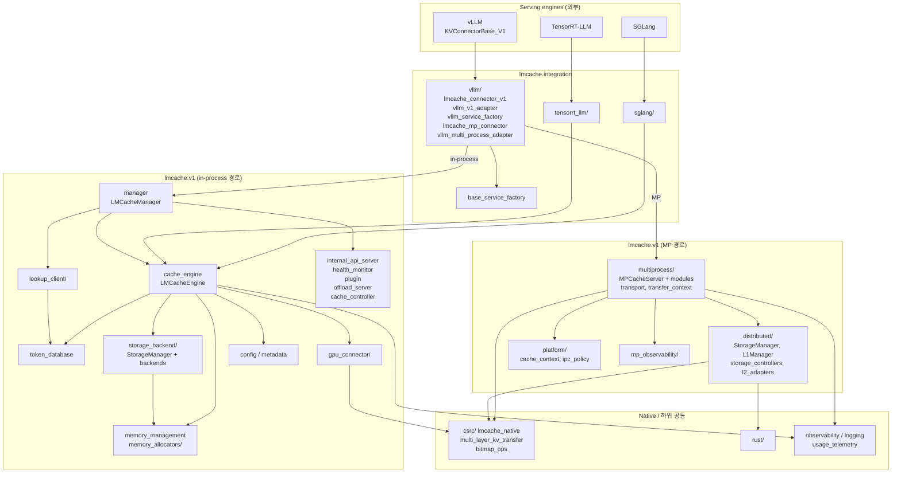

---

## 2. Component View — In-process 모드

vLLM 은 Scheduler 프로세스(EngineCore)와 TP rank 별 Worker 프로세스로 나뉜다.
LMCache 는 **두 종류 프로세스 모두에 `LMCacheConnectorV1Impl` 을 올리고**, role 로 구성요소를 달리한다.

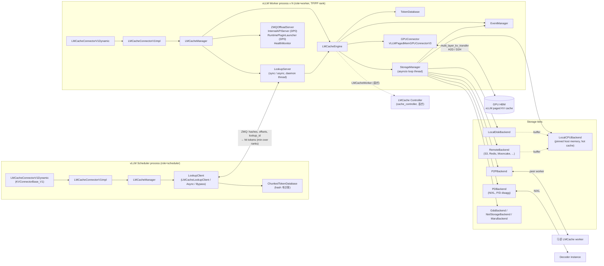

---

## 3. Component View — Multiprocess(MP) 모드

캐시 소유권이 vLLM 밖의 `lmcache server` 로 이동한다. vLLM 쪽은 key + block id + CUDA event 만 보낸다.

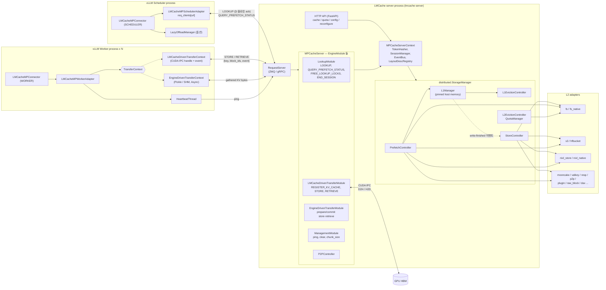

---

## 4. Class Diagram — Connector / Manager / Factory

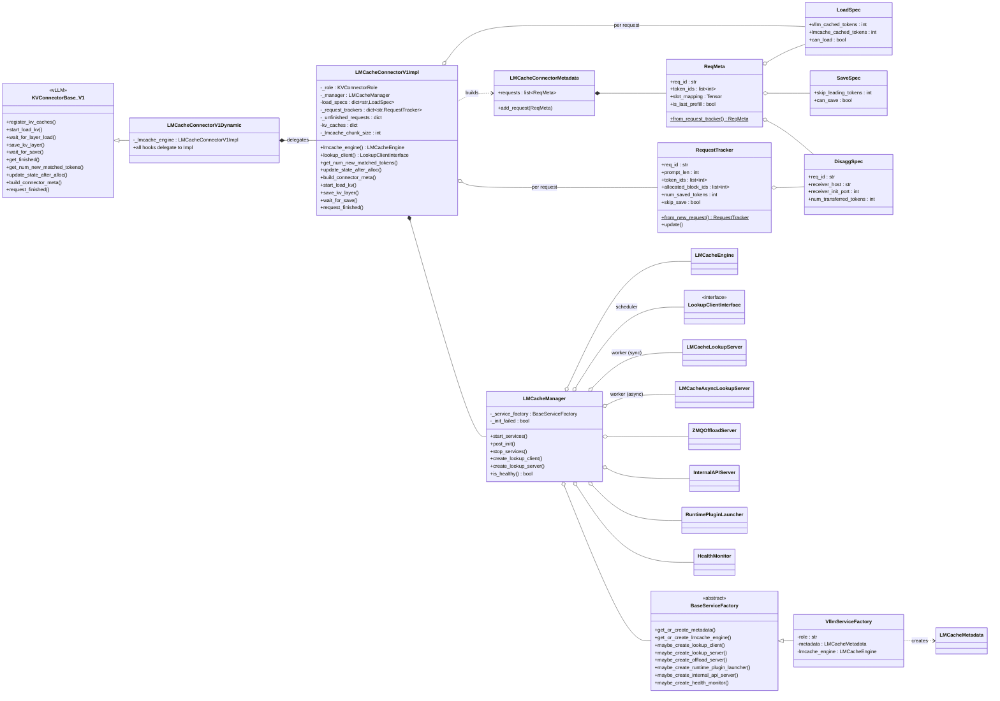

---

## 5. Class Diagram — LMCacheEngine 코어

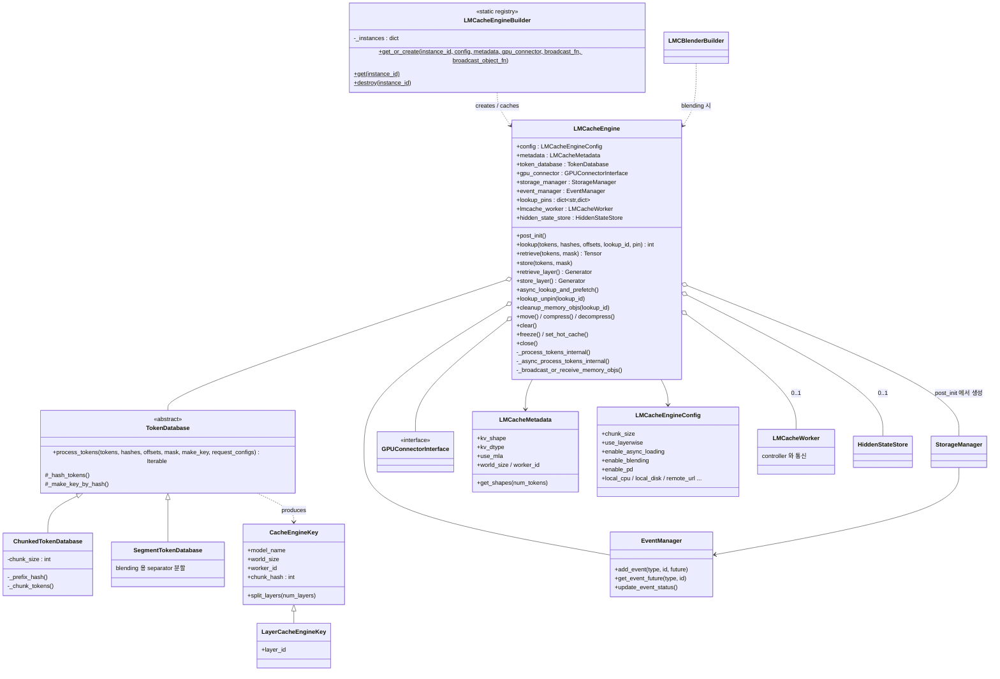

---

## 6. Class Diagram — Storage backend 계층, MemoryObj, Allocator

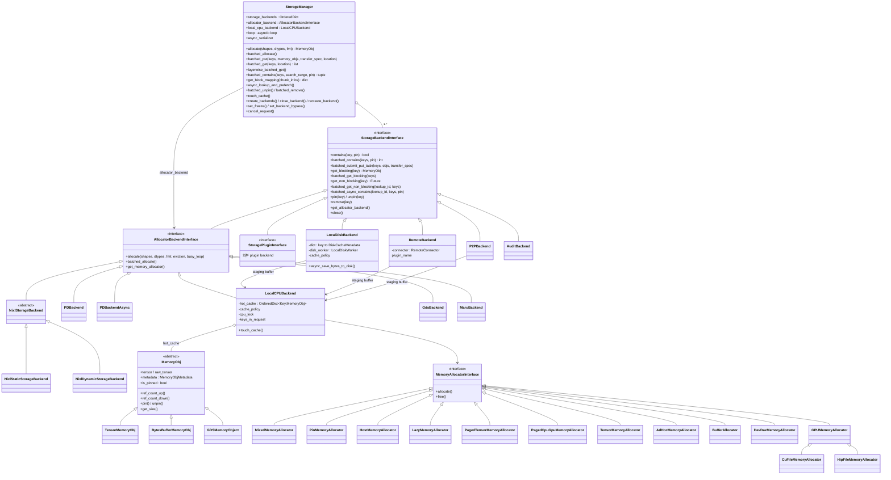

---

## 7. Class Diagram — Lookup client·server, GPU connector

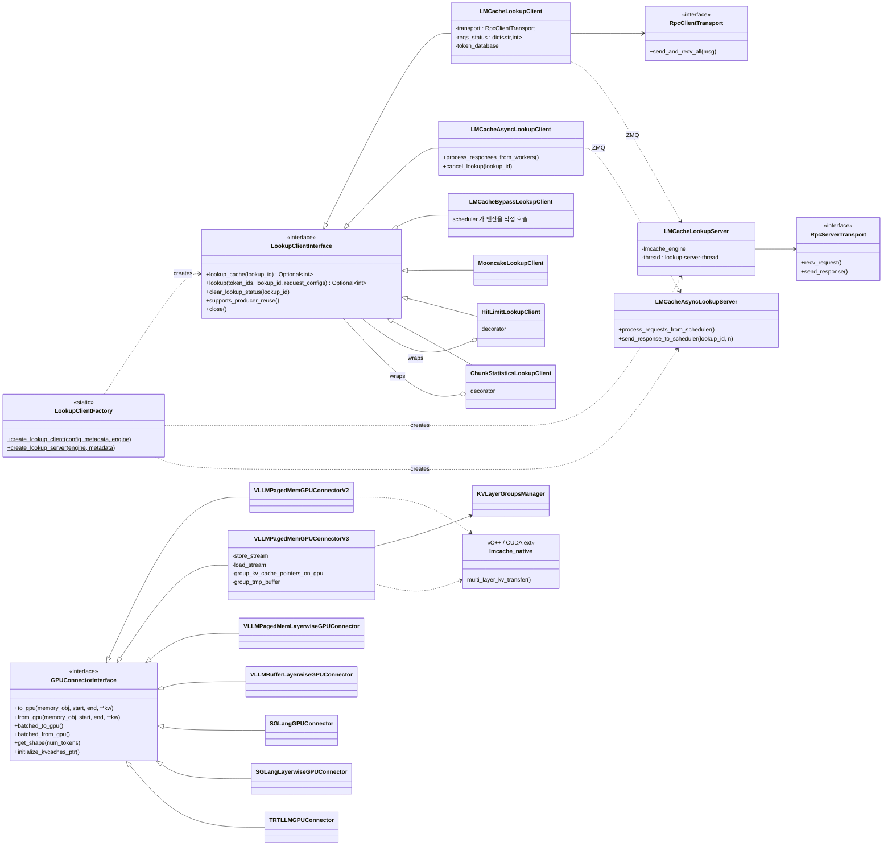

---

## 8. Class Diagram — MP 서버

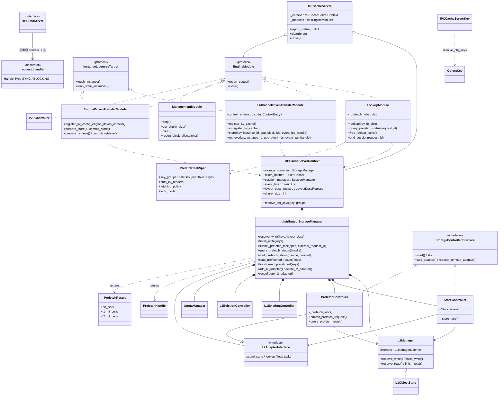

---

## 9. Sequence — 초기화

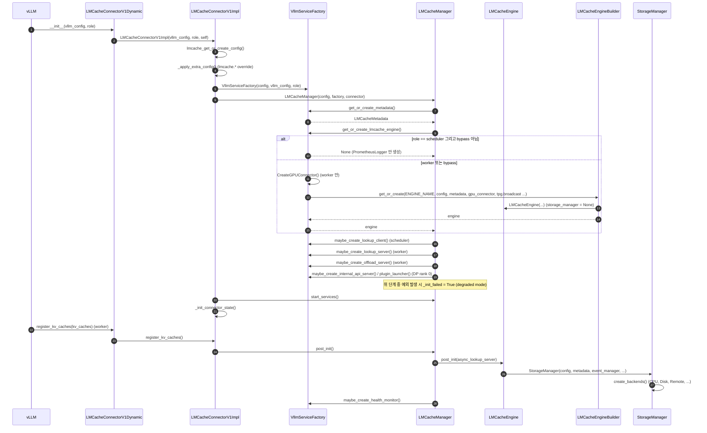

---

## 10. Sequence — Lookup (Scheduler → Worker, 동기 경로)

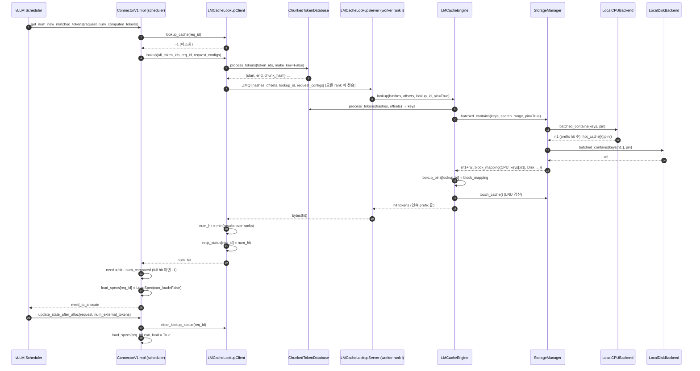

---

## 11. Sequence — Load (`start_load_kv`, non-layerwise)

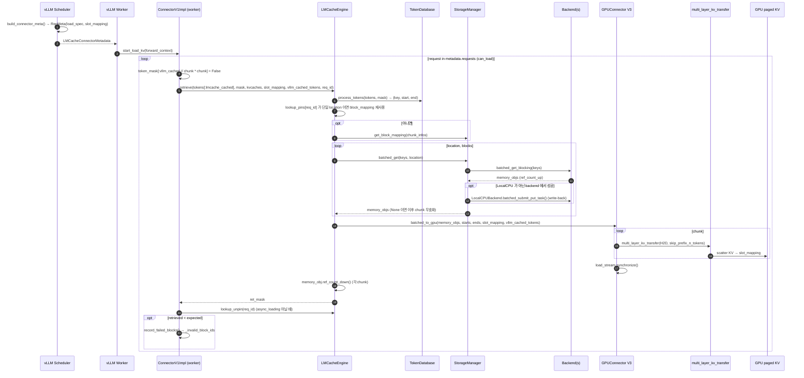

---

## 12. Sequence — Store (`wait_for_save`, non-layerwise)

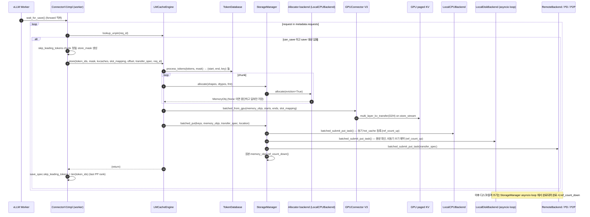

---

## 13. Sequence — Async loading (`enable_async_loading`)

lookup 단계에서 backend → CPU 버퍼 prefetch 가 함께 수행되고, scheduler 는 `None` ("진행 중") 을 받는다.

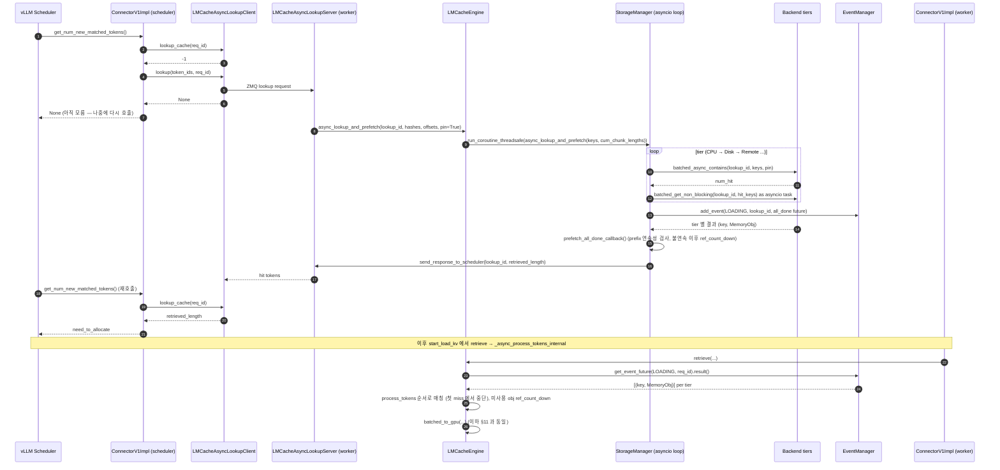

---

## 14. Sequence — MP 모드 (lookup → retrieve → store)

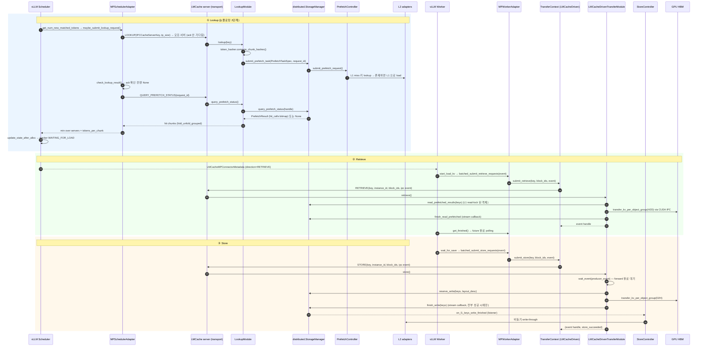

---

## 15. State 다이어그램

### 15-a. MP request 상태 (`LMCacheMPRequestState`)

상태 이름과 주요 전이(`PREFETCHING→WAITING_FOR_LOAD→READY⇄BYPASS_LMCACHE`)는 `lmcache_mp_metadata.py::LMCacheMPRequestState` 의 docstring 에 명시돼 있다.
`PREFETCHING→READY` 직행(retrieve 불필요)과 종료 전이는 `update_state_after_alloc` 분기에서 읽은 것이다.

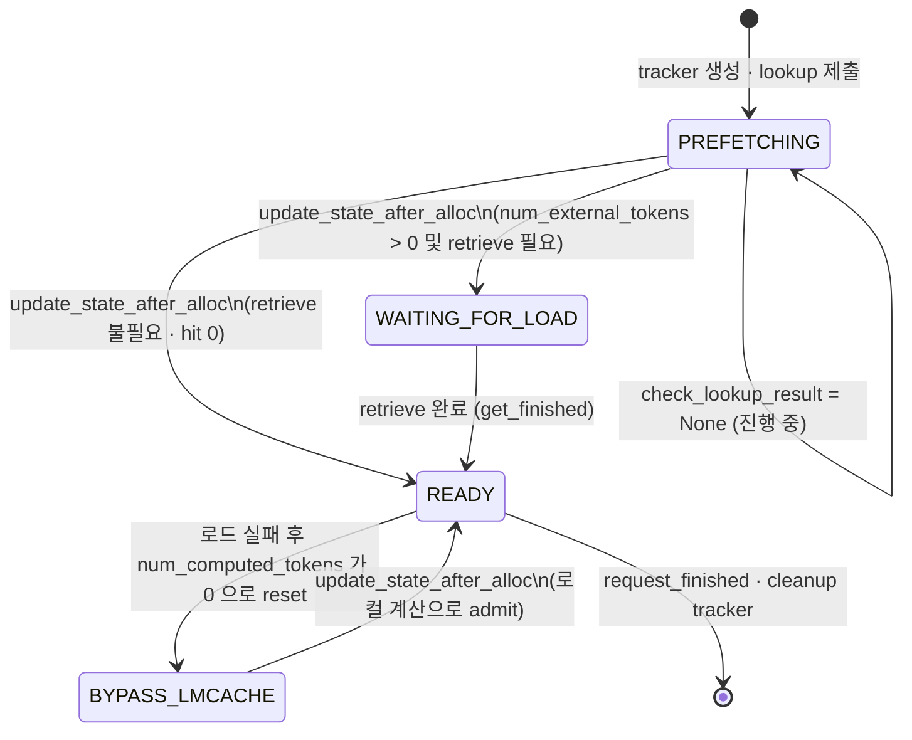

### 15-b. `MemoryObj` pin / ref-count 수명 (in-process, LocalCPU)

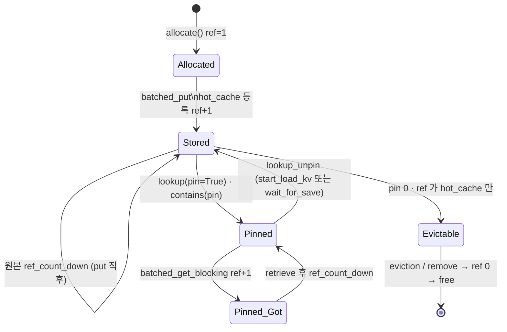

---

## 16. Deployment 다이어그램

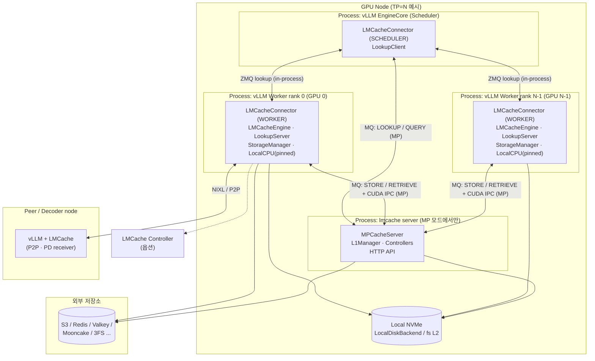

---

## 부록: 다이어그램 해석 시 유의점

- **Class 다이어그램은 일부 속성·메서드만 표기**했다. 특히 `LMCacheEngine`, `StorageManager` 는 실제로는 훨씬 많은 관리용 메서드
  (health, freeze, backend bypass, reconfigure 등)를 갖는다.
- `LMCacheConnectorV1Dynamic` 은 `lmcache_connector_v1.py` 와 `lmcache_connector_v1_085.py` 두 버전이 존재한다
  (vLLM 0.8.5 호환용). 그림에서는 최신 쪽 하나로 표기했다.
- Sequence 에서 `Allocator backend` 는 PD/Maru 구성이면 `LocalCPUBackend` 가 아닐 수 있다
  (`StorageManager._get_allocator_backend`).
- 15-b 의 ref-count 전이는 코드 분기를 읽고 재구성한 **해석**이며,
  명시적 FSM 구현이 아니다. 15-a 도 docstring 에 없는 전이는 같은 방식으로 해석했다.
  (아래 중복 문장 제거용)
- 정확한 ref 값(예: 중복 put 시 skip)은 `local_cpu_backend.py` 를 확인할 것.
- MP 서버 §8 의 `EngineModule` / `InstanceLivenessTarget` 은 `lmcache/v1/multiprocess/engine_module.py` 에서 `typing.Protocol` 임을 확인했다.
